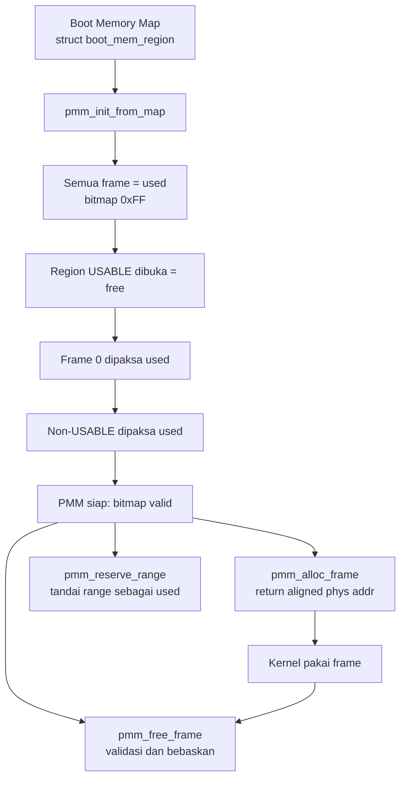

# Template Laporan Praktikum Sistem Operasi Lanjut — MCSOS

**Nama file laporan:** `laporan_praktikum_[M6]_[nim_atau_kelompok].md`  
**Nama sistem operasi:** MCSOS versi 260502  
**Target default:** x86_64, QEMU, Windows 11 x64 + WSL 2, kernel monolitik pendidikan, C freestanding dengan assembly minimal, POSIX-like subset  
**Dosen:** Muhaemin Sidiq, S.Pd., M.Pd.  
**Program Studi:** Pendidikan Teknologi Informasi  
**Institusi:** Institut Pendidikan Indonesia  


# Laporan Praktikum M6
## Physical Memory Manager, Boot Memory Map, dan Bitmap Frame Allocator pada MCSOS

---

## 0. Metadata Laporan

| Atribut | Isi |
|---|---|
| Kode praktikum | M6 |
| Judul praktikum | Physical Memory Manager, Boot Memory Map, dan Bitmap Frame Allocator pada MCSOS |
| Jenis pengerjaan | Individu |
| Nama mahasiswa | Siti Sumyati |
| NIM | 2583207073008 |
| Kelas | 1B |
| Nama kelompok | - |
| Anggota kelompok | - |
| Tanggal praktikum | 2026-06-28 |
| Tanggal pengumpulan | 2026-06-28 |
| Repository | `/home/sitisumyati/src/mcsos` |
| Branch | `m6-pmm` |
| Commit awal | baseline M5 (sebelum branch m6-pmm) |
| Commit akhir | `c013800` |
| Status readiness yang diklaim | Siap uji QEMU |

---

## 1. Sampul

# Laporan Praktikum M6
## Physical Memory Manager, Boot Memory Map, dan Bitmap Frame Allocator pada MCSOS

Disusun oleh:

| Nama | NIM | Kelas | Peran |
|---|---|---|---|
| Siti Sumyati | 2583207073008 | 1B | Individu — implementasi, pengujian, dokumentasi |

Dosen Pengampu: **Muhaemin Sidiq, S.Pd., M.Pd.**
Program Studi Pendidikan Teknologi Informasi
Institut Pendidikan Indonesia
Tahun Akademik 2025/2026

---

## 2. Pernyataan Orisinalitas dan Integritas Akademik

Saya menyatakan bahwa laporan ini disusun berdasarkan pekerjaan praktikum sendiri sesuai pembagian peran yang tercatat. Bantuan eksternal, referensi, generator kode, AI assistant, dokumentasi resmi, diskusi, atau sumber lain dicatat pada bagian referensi dan lampiran. Saya tidak mengklaim hasil yang tidak dibuktikan oleh log, test, commit, atau artefak lain.

| Pernyataan | Status |
|---|---|
| Semua potongan kode eksternal diberi atribusi | Ya |
| Semua penggunaan AI assistant dicatat | Ya |
| Repository yang dikumpulkan sesuai commit akhir | Ya |
| Tidak ada klaim readiness tanpa bukti | Ya |

Catatan penggunaan bantuan eksternal:

```text
Panduan implementasi M6 (OS_panduan_M6.md) dari dosen digunakan sebagai acuan utama.
Kode pmm.h, pmm.c, test_pmm_host.c, dan check_m6_static.sh mengikuti contoh yang
disediakan dalam panduan, dengan penyesuaian path sesuai struktur repository MCSOS.
Integrasi ke kmain.c disesuaikan dengan struktur kernel yang sudah ada dari M5.
Verifikasi dilakukan mandiri: host unit test, freestanding audit, build, dan QEMU smoke test.
```

---

## 3. Tujuan Praktikum

1. Mengimplementasikan Physical Memory Manager (PMM) berbasis bitmap untuk mengelola frame fisik 4096 byte pada kernel MCSOS.
2. Mengubah boot memory map menjadi status frame: used, free, dan reserved, dengan prinsip fail-closed.
3. Menyediakan API PMM (`pmm_init_from_map`, `pmm_alloc_frame`, `pmm_free_frame`, `pmm_reserve_range`) yang dapat digunakan oleh kernel.
4. Menulis host unit test untuk menguji logika PMM tanpa QEMU dan memastikan object PMM tidak memiliki dependensi libc (freestanding audit).
5. Mengintegrasikan PMM ke kernel MCSOS setelah serial log dan panic path siap, serta membuktikan fungsi dengan log QEMU.

---

## 4. Capaian Pembelajaran Praktikum

Setelah praktikum ini, mahasiswa mampu:

| CPL/CPMK praktikum | Bukti yang harus ditunjukkan |
|---|---|
| Mengimplementasikan bitmap allocator untuk frame fisik 4096 byte | Source `pmm.c`, host unit test PASS, QEMU log |
| Menjelaskan alasan PMM harus fail-closed (semua frame dianggap used sebelum dibuka) | Desain teknis bagian 9, kode `pmm_init_from_map` |
| Melakukan alignment base dan length agar frame partial tidak dialokasikan | Fungsi `align_up`/`align_down` pada `pmm.c` |
| Menangani overflow `base + length` secara eksplisit | Fungsi `checked_add_u64` pada `pmm.c` |
| Menulis host unit test untuk logika kernel tanpa hardware | `tests/test_pmm_host.c`, output PASS |
| Menghasilkan bukti `nm -u`, `objdump`, dan log QEMU | `build/pmm.undefined.txt` kosong, `build/qemu-serial.log` |

---

## 5. Peta Milestone MCSOS

| Milestone | Fokus | Status dalam laporan |
|---|---|---|
| M0 | Requirements, governance, baseline arsitektur | [x] selesai praktikum sebelumnya |
| M1 | Toolchain reproducible, Git, QEMU, GDB, metadata build | [x] selesai praktikum sebelumnya |
| M2 | Boot image, kernel ELF64, early console | [x] selesai praktikum sebelumnya |
| M3 | Panic path, linker map, GDB, observability awal | [x] selesai praktikum sebelumnya |
| M4 | Trap, exception, interrupt, IDT | [x] selesai praktikum sebelumnya |
| M5 | External interrupt, PIC, PIT, timer | [x] selesai praktikum sebelumnya |
| M6 | Physical Memory Manager, bitmap frame allocator | [x] selesai praktikum ini |
| M7 | VMM, page table, kernel heap | [ ] tidak dibahas |

Batas cakupan praktikum:

```text
M6 mencakup: implementasi PMM berbasis bitmap, boot memory map normalisasi, host unit test,
freestanding audit, dan integrasi ke kernel dengan log serial.

M6 tidak mencakup: virtual memory manager, penggantian CR3 atau page table baru, heap dinamis
(kmalloc), reklamasi BOOTLOADER_RECLAIMABLE, dukungan SMP, dan locking PMM dari interrupt context.
```

---

## 6. Dasar Teori Ringkas

### 6.1 Konsep Sistem Operasi yang Diuji

```text
Boot Memory Map: Sumber kebenaran awal untuk region fisik yang diberikan bootloader kepada kernel.
Setiap region memiliki base address, length, dan tipe (USABLE, RESERVED, KERNEL_AND_MODULES, dll).

Physical Frame: Unit alokasi memori fisik berukuran 4096 byte. Setiap frame direpresentasikan
oleh satu bit dalam bitmap: 1 = used/reserved, 0 = free.

Physical Memory Manager (PMM): Komponen kernel yang mengubah boot memory map menjadi
himpunan frame yang dapat dikelola. PMM menyediakan operasi alloc dan free untuk frame fisik.

Bitmap Allocator: Struktur data yang menggunakan satu bit per frame untuk melacak status.
Ukuran bitmap = jumlah_frame / 8 byte. Keunggulannya: sederhana, deterministik, O(n) worst case.

Fail-Closed: Prinsip keamanan di mana status default adalah "tidak aman dipakai" (used),
bukan "aman dipakai" (free). Hanya region yang eksplisit dinyatakan USABLE yang dibuka.

Reserved Memory: Region fisik yang tidak boleh dipakai kernel umum karena berisi kernel image,
module, framebuffer, ACPI table, firmware, atau bad memory.
```

### 6.2 Konsep Arsitektur x86_64 yang Relevan

| Konsep | Relevansi pada praktikum | Bukti/verifikasi |
|---|---|---|
| Physical address space | PMM mengelola frame fisik dalam address space 0..max_phys | `frames_managed=0x1000000` pada serial log |
| Frame alignment 4096 byte | Setiap frame harus aligned 4096 byte; PMM menolak alamat non-aligned | `align_up`/`align_down` di `pmm.c`, test assert alignment |
| Integer overflow pada pointer arithmetic | `base + length` dapat wraparound pada uint64_t | `checked_add_u64()` diuji di host test |
| Kernel virtual address | Kernel image di `0xffffffff80000000`, PMM menerima physical address | `kernel_start=0xffffffff80000000` di serial log |

### 6.3 Konsep Implementasi Freestanding

| Aspek | Keputusan praktikum |
|---|---|
| Bahasa | C17 freestanding |
| Runtime | Tanpa hosted libc; `pmm.c` tidak memanggil printf, malloc, memset, atau libc lain |
| ABI | x86_64 System V, kernel internal |
| Compiler flags kritis | `-ffreestanding -fno-builtin -fno-stack-protector -mno-red-zone` |
| Risiko undefined behavior | Integer overflow pada `base + length` dimitigasi dengan `checked_add_u64`; alignment dicek eksplisit |

### 6.4 Referensi Teori yang Digunakan

| No. | Sumber | Bagian yang digunakan | Alasan relevansi |
|---|---|---|---|
| [1] | Limine Rust crate documentation, "MemoryMapRequest," docs.rs, 2026 | Memory map entry types, alignment guarantees | Sumber tipe USABLE, BOOTLOADER_RECLAIMABLE, dan jaminan alignment region |
| [2] | Intel Corporation, Intel 64 and IA-32 Architectures Software Developer's Manual, 2026 | Memory management, paging | Dasar frame 4096 byte dan address space x86_64 |
| [3] | QEMU Project, "GDB usage," QEMU System Emulation Documentation, 2026 | GDB stub `-s -S` | Debugging kernel via GDB jika terjadi fault |
| [4] | Muhaemin Sidiq, Panduan Praktikum M6 MCSOS versi 260502, 2026 | Seluruh panduan | Acuan implementasi, kontrak API, urutan inisialisasi, failure modes |

---

## 7. Lingkungan Praktikum

### 7.1 Host dan Target

| Komponen | Nilai |
|---|---|
| Host OS | Windows 11 x64 dengan WSL 2 |
| Lingkungan build | Ubuntu (WSL 2), hostname LAPTOP-E59VKM6A |
| Target ISA | x86_64 |
| Target ABI | x86_64-unknown-none-elf (freestanding) |
| Emulator | QEMU 8.2.2 |
| Firmware emulator | OVMF (ditemukan otomatis oleh run_qemu.sh) |
| Debugger | GDB (tersedia) |
| Build system | Make |
| Bahasa utama | C17 freestanding |
| Assembly | GAS (clang assembler) |

### 7.2 Versi Toolchain

```text
Ubuntu clang version 18.1.3 (1ubuntu1)
Target: x86_64-pc-linux-gnu
Thread model: posix
InstalledDir: /usr/bin

GNU nm (GNU Binutils for Ubuntu) 2.42

QEMU emulator version 8.2.2 (Debian 1:8.2.2+ds-0ubuntu1.16)
```

### 7.3 Lokasi Repository

| Item | Nilai |
|---|---|
| Path repository di WSL | `/home/sitisumyati/src/mcsos` |
| Apakah berada di filesystem Linux WSL, bukan `/mnt/c` | Ya |
| Remote repository | - |
| Branch | `m6-pmm` |
| Commit hash akhir | `c013800` |

---

## 8. Repository dan Struktur File

### 8.1 Struktur Direktori yang Relevan

```text
mcsos/
├── Makefile
├── linker.ld
├── kernel/
│   ├── arch/x86_64/
│   │   ├── include/
│   │   ├── idt.c
│   │   ├── pic.c
│   │   ├── pit.c
│   │   ├── boot.S
│   │   └── isr.S
│   ├── core/
│   │   ├── kmain.c        ← diubah: tambah m6_pmm_init()
│   │   ├── pmm.c          ← BARU: implementasi PMM
│   │   ├── log.c
│   │   ├── panic.c
│   │   ├── serial.c
│   │   └── trap.c
│   ├── include/
│   │   ├── pmm.h          ← BARU: header API PMM
│   │   ├── types.h        ← BARU: tipe dasar freestanding
│   │   └── mcsos/
│   └── lib/
│       └── memory.c
├── tests/
│   └── test_pmm_host.c    ← BARU: host unit test PMM
├── scripts/
│   └── check_m6_static.sh ← BARU: script audit statis
└── build/
    ├── mcsos-m5.elf
    ├── pmm.o
    ├── pmm.undefined.txt
    ├── qemu-serial.log
    └── ...
```

### 8.2 File yang Dibuat atau Diubah

| File | Jenis perubahan | Alasan perubahan | Risiko |
|---|---|---|---|
| `kernel/include/types.h` | Baru | Tipe dasar freestanding (`bool`, `size_t`) untuk PMM | Rendah — hanya typedef dengan guard |
| `kernel/include/pmm.h` | Baru | Header kontrak API PMM | Rendah — hanya deklarasi |
| `kernel/core/pmm.c` | Baru | Implementasi inti PMM bitmap allocator | Sedang — logika alokasi frame fisik |
| `tests/test_pmm_host.c` | Baru | Host unit test untuk validasi logika PMM | Rendah — hanya test, tidak masuk kernel |
| `scripts/check_m6_static.sh` | Baru | Script audit statis otomatis | Rendah — hanya script build dan check |
| `kernel/core/kmain.c` | Ubah | Menambahkan pemanggilan `m6_pmm_init()` setelah M5 | Sedang — mengubah alur boot kernel |

### 8.3 Ringkasan Diff

```bash
git diff --stat HEAD~1
git log --oneline -n 3
```

Output:

```text
[m6-pmm c013800] m6: implement bitmap PMM with host unit test and kernel integration
 6 files changed, 440 insertions(+), 42 deletions(-)
 create mode 100644 kernel/core/pmm.c
 create mode 100644 kernel/include/pmm.h
 create mode 100644 kernel/include/types.h
 create mode 100755 scripts/check_m6_static.sh
 create mode 100644 tests/test_pmm_host.c
```

---

## 9. Desain Teknis

### 9.1 Masalah yang Diselesaikan

```text
Kernel MCSOS setelah M5 memiliki interrupt path dan timer yang berjalan, tetapi belum
memiliki mekanisme untuk mengetahui frame fisik mana yang boleh dipakai dan mana yang tidak.
Tanpa PMM, kernel tidak dapat mengalokasikan memori fisik secara aman karena tidak ada
informasi tentang region yang sudah dipakai firmware, bootloader, kernel image, atau perangkat.

M6 menyelesaikan masalah ini dengan mengimplementasikan bitmap frame allocator yang:
1. Menerima boot memory map dari bootloader
2. Menandai semua frame sebagai used secara default (fail-closed)
3. Membuka hanya region USABLE sebagai frame bebas
4. Memastikan frame 0, kernel image, dan region non-usable tetap reserved
5. Menyediakan API alloc/free yang aman untuk digunakan kernel
```

### 9.2 Keputusan Desain

| Keputusan | Alternatif yang dipertimbangkan | Alasan memilih | Konsekuensi |
|---|---|---|---|
| Bitmap statik ukuran tetap (64GiB) | Bitmap dinamis di region usable terbesar | Lebih sederhana, tidak memerlukan allocator untuk bitmap itu sendiri | Bitmap berukuran 2MB selalu ada di BSS, tidak fleksibel untuk sistem >64GiB |
| Fail-closed: semua frame default used | Fail-open: semua frame default free | Lebih aman; region tidak dikenal tidak digunakan | Memerlukan pemrosesan memory map eksplisit |
| Non-usable menimpa usable (diproses setelah) | Usable menimpa non-usable | Mencegah korupsi jika region overlap akibat firmware | Non-usable selalu menang |
| Frame 0 selalu reserved | Frame 0 diikutkan jika ada di USABLE | Menangkap kesalahan alamat fisik nol (null-like physical) | Satu frame terbuang |
| Static memory map dummy di kernel | Adapter Limine runtime | Lebih sederhana untuk M6; Limine adapter belum tersedia di repo | Memory map tidak mencerminkan kondisi QEMU sebenarnya (acceptable untuk M6) |

### 9.3 Arsitektur Ringkas



Penjelasan diagram:

```text
Alur dimulai dari boot memory map yang berisi daftar region fisik dengan tipe masing-masing.
pmm_init_from_map memproses map dalam 4 tahap berurutan: (1) set semua frame used, (2) buka
region USABLE, (3) paksa frame 0 used, (4) paksa semua non-USABLE used. Hasilnya adalah
bitmap yang valid dan PMM siap digunakan. Kernel kemudian dapat memanggil pmm_alloc_frame
untuk mendapat frame bebas, dan pmm_free_frame untuk mengembalikannya.
```

### 9.4 Kontrak Antarmuka

| Antarmuka | Pemanggil | Penerima | Precondition | Postcondition | Error path |
|---|---|---|---|---|---|
| `pmm_init_from_map` | `kmain` via `m6_pmm_init` | `pmm.c` | regions != NULL, bitmap_storage valid, max_phys aligned 4096 | bitmap valid, initialized=true | return false → kernel panic |
| `pmm_alloc_frame` | `m6_pmm_init` (smoke test) | `pmm.c` | PMM initialized, free_frames > 0 | frame returned, bit set used | return PMM_INVALID_FRAME |
| `pmm_free_frame` | `m6_pmm_init` (smoke test) | `pmm.c` | PMM initialized, phys_addr aligned, bukan frame 0, sudah used | bit cleared, free_frames++ | return false jika invalid |
| `pmm_reserve_range` | kernel subsystem | `pmm.c` | PMM initialized, length > 0 | range ditandai used | return false jika invalid |

### 9.5 Struktur Data Utama

| Struktur data | Field penting | Ownership | Lifetime | Invariant |
|---|---|---|---|---|
| `struct pmm_state` | `bitmap`, `frame_count`, `free_frames`, `used_frames`, `initialized` | Kernel global (`kernel_pmm`) | Selama kernel hidup | `free_frames + used_frames == frame_count` setelah init |
| `struct boot_mem_region` | `base`, `length`, `type` | Stack lokal `m6_pmm_init` | Selama `pmm_init_from_map` | base dan length valid, tidak overflow |
| `kernel_pmm_bitmap[]` | Array uint8_t 8MB | BSS kernel, aligned 4096 | Selama kernel hidup | Index valid dalam range `[0, PMM_BITMAP_BYTES)` |

### 9.6 Invariants

1. `free_frames + used_frames == frame_count` setelah `pmm_init_from_map` berhasil.
2. Frame 0 (`phys_addr == 0`) selalu dalam status used; tidak pernah dialokasikan.
3. Alamat hasil `pmm_alloc_frame()` selalu aligned 4096 byte dan bukan 0.
4. `pmm_free_frame()` menolak: alamat non-aligned, alamat 0, alamat >= max_phys, dan double free (frame sudah free).
5. Region non-usable selalu menimpa region usable jika terjadi overlap (diproses setelah usable).
6. Overflow `base + length` membatalkan operasi range (checked_add_u64 return false).

### 9.7 Ownership, Locking, dan Concurrency

| Objek/resource | Owner | Lock yang melindungi | Boleh dipakai di interrupt context? | Catatan |
|---|---|---|---|---|
| `kernel_pmm` | Kernel global | Tidak ada (M6 single-core) | Tidak | M6 hanya valid single-core early kernel |
| `kernel_pmm_bitmap` | `kernel_pmm.bitmap` | Tidak ada | Tidak | Jangan panggil alloc/free dari IRQ handler |

Lock order yang berlaku:

```text
M6 tidak memiliki locking. PMM hanya boleh diakses dari kernel context single-core sebelum
interrupt stabil atau sebelum SMP diaktifkan. Pada milestone SMP, PMM harus dilindungi
spinlock atau diganti dengan per-CPU page cache.
```

### 9.8 Memory Safety dan Undefined Behavior Risk

| Risiko | Lokasi | Mitigasi | Bukti |
|---|---|---|---|
| Integer overflow `base + length` | `mark_range_free`, `mark_range_used` | `checked_add_u64()` mengembalikan false jika overflow | Host unit test, kode eksplisit |
| Out-of-bounds bitmap access | `bitmap_set`, `bitmap_clear`, `bitmap_test` | Frame index dicek `< frame_count` sebelum akses | `mark_frame_free`, `mark_frame_used` guard |
| Alokasi frame 0 (null-like physical) | `pmm_init_from_map` | `mark_range_used(0, PMM_PAGE_SIZE)` setelah buka usable | Host test: `assert(!pmm_is_frame_free(&pmm, 0))` |
| Double free | `pmm_free_frame` | Cek `bitmap_test` sebelum clear; return false jika sudah free | Host test: `assert(!pmm_free_frame(&pmm, frame))` setelah free |

### 9.9 Security Boundary

| Boundary | Data tidak tepercaya | Validasi yang dilakukan | Failure mode aman |
|---|---|---|---|
| Boot memory map | Region firmware/bootloader bisa tidak rapi atau overlap | Fail-closed: non-usable menimpa usable; overflow dicek | Frame invalid tidak dibuka |
| `pmm_free_frame` input | Alamat fisik dari kernel | Cek aligned, bukan 0, dalam range, belum free | Return false, tidak corrupt bitmap |
| `pmm_alloc_frame` | - | Cek initialized dan free_frames > 0 | Return PMM_INVALID_FRAME |

---

## 10. Langkah Kerja Implementasi

### Langkah 1 — Verifikasi M5 Masih Stabil

Maksud langkah:

```text
Memastikan fondasi M5 (serial log, panic path, IDT, timer) tidak rusak sebelum
menambahkan kode M6. Jika M5 sudah tidak stabil, debugging M6 akan jauh lebih sulit.
```

Perintah:

```bash
cd ~/src/mcsos
git status --short
make clean && make all 2>&1 | tail -10
```

Output ringkas:

```text
(git status kosong — repo bersih)
grep -q 'iretq' build/disassembly.txt  ← PASS
grep -q 'lidt' build/disassembly.txt   ← PASS
```

Artefak yang dihasilkan:

| Artefak | Lokasi | Fungsi |
|---|---|---|
| `mcsos-m5.elf` | `build/mcsos-m5.elf` | Kernel ELF64 baseline M5 |

Indikator berhasil:

```text
make all selesai tanpa error. IDT dan iretq ada di disassembly.
```

---

### Langkah 2 — Buat Branch M6 dan Folder

Maksud langkah:

```text
Memisahkan perubahan M6 dari baseline M5 agar rollback mudah dilakukan jika terjadi masalah.
```

Perintah:

```bash
git switch -c m6-pmm
mkdir -p tests scripts
```

Output ringkas:

```text
Switched to a new branch 'm6-pmm'
```

Indikator berhasil:

```text
Branch m6-pmm aktif. Folder tests/ dan scripts/ tersedia.
```

---

### Langkah 3 — Tulis `kernel/include/types.h`

Maksud langkah:

```text
Menyediakan tipe dasar (bool, size_t) untuk PMM freestanding. File ini meng-include
<stdint.h> dan <stddef.h> dari toolchain agar tidak ada konflik typedef dengan stdint.h
yang sudah di-include oleh kmain.c.
```

Perintah:

```bash
cat > kernel/include/types.h <<'EOF'
#ifndef MCSOS_TYPES_H
#define MCSOS_TYPES_H

#include <stdint.h>
#include <stddef.h>

typedef int bool;

#define true 1
#define false 0
#ifndef NULL
#define NULL ((void *)0)
#endif

#endif
EOF
```

Artefak yang dihasilkan:

| Artefak | Lokasi | Fungsi |
|---|---|---|
| `types.h` | `kernel/include/types.h` | Tipe dasar freestanding untuk PMM |

Indikator berhasil:

```text
ls kernel/include/ menampilkan: mcsos  types.h
```

---

### Langkah 4 — Tulis `kernel/include/pmm.h`

Maksud langkah:

```text
Mendefinisikan kontrak API PMM: konstanta, enum tipe memory, struct boot_mem_region,
struct pmm_state, dan deklarasi semua fungsi PMM.
```

Perintah:

```bash
cat > kernel/include/pmm.h <<'EOF'
(... isi header pmm.h ...)
EOF
```

Artefak yang dihasilkan:

| Artefak | Lokasi | Fungsi |
|---|---|---|
| `pmm.h` | `kernel/include/pmm.h` | Header kontrak API PMM |

Indikator berhasil:

```text
ls kernel/include/ menampilkan: mcsos  pmm.h  types.h
```

---

### Langkah 5 — Tulis `kernel/core/pmm.c`

Maksud langkah:

```text
Mengimplementasikan seluruh logika PMM: bitmap manipulation, mark_range_free,
mark_range_used, pmm_init_from_map, pmm_alloc_frame, pmm_free_frame, dan fungsi query.
Tidak memanggil libc sama sekali agar dapat digunakan di kernel freestanding.
```

Perintah:

```bash
cat > kernel/core/pmm.c <<'EOF'
(... isi implementasi pmm.c ...)
EOF
```

Artefak yang dihasilkan:

| Artefak | Lokasi | Fungsi |
|---|---|---|
| `pmm.c` | `kernel/core/pmm.c` | Implementasi inti PMM bitmap allocator |

Indikator berhasil:

```text
ls kernel/core/ menampilkan: kmain.c  log.c  panic.c  pmm.c  serial.c  trap.c
```

---

### Langkah 6 — Tulis `tests/test_pmm_host.c`

Maksud langkah:

```text
Menulis host unit test untuk menguji logika PMM tanpa perlu boot QEMU.
Test mencakup: inisialisasi dengan 5 region, cek frame 0 reserved, alloc/free,
double free detection, dan reserve_range.
```

Perintah:

```bash
cat > tests/test_pmm_host.c <<'EOF'
(... isi test_pmm_host.c ...)
EOF
```

Artefak yang dihasilkan:

| Artefak | Lokasi | Fungsi |
|---|---|---|
| `test_pmm_host.c` | `tests/test_pmm_host.c` | Host unit test PMM |

Indikator berhasil:

```text
ls tests/ menampilkan: test_pmm_host.c  toolchain
```

---

### Langkah 7 — Tulis `scripts/check_m6_static.sh` dan Jalankan

Maksud langkah:

```text
Script ini mengotomatiskan: (1) kompilasi pmm.c sebagai freestanding object,
(2) kompilasi dan jalankan host test, (3) audit nm -u untuk cek unresolved symbol,
(4) hasilkan objdump. Satu perintah untuk membuktikan semua kriteria statis M6.
```

Perintah:

```bash
cat > scripts/check_m6_static.sh <<'EOF'
#!/usr/bin/env bash
set -euo pipefail
mkdir -p build
: "${CC:=clang}"
: "${HOSTCC:=clang}"
${CC} -std=c17 -Wall -Wextra -Werror \
  -ffreestanding -fno-builtin -fno-stack-protector -mno-red-zone \
  -Ikernel/include -c kernel/core/pmm.c -o build/pmm.o
${HOSTCC} -std=c17 -Wall -Wextra -Werror \
  -Ikernel/include kernel/core/pmm.c tests/test_pmm_host.c -o build/test_pmm_host
./build/test_pmm_host
nm -u build/pmm.o | tee build/pmm.undefined.txt
objdump -dr build/pmm.o > build/pmm.objdump.txt
if grep -q . build/pmm.undefined.txt; then
  echo "[FAIL] pmm.o masih memiliki unresolved symbol" >&2
  exit 1
fi
echo "[PASS] M6 static check selesai"
EOF
chmod +x scripts/check_m6_static.sh
./scripts/check_m6_static.sh
```

Output ringkas:

```text
M6 PMM host unit test: PASS
[PASS] M6 static check selesai
```

Artefak yang dihasilkan:

| Artefak | Lokasi | Fungsi |
|---|---|---|
| `build/pmm.o` | `build/pmm.o` | Object freestanding PMM |
| `build/test_pmm_host` | `build/test_pmm_host` | Binary host unit test |
| `build/pmm.undefined.txt` | `build/pmm.undefined.txt` | Daftar unresolved symbol (kosong = PASS) |
| `build/pmm.objdump.txt` | `build/pmm.objdump.txt` | Disassembly PMM object |

Indikator berhasil:

```text
Output: "M6 PMM host unit test: PASS" dan "[PASS] M6 static check selesai"
nm -u build/pmm.o tidak menghasilkan output (kosong = freestanding bersih)
```

---

### Langkah 8 — Integrasi PMM ke `kernel/core/kmain.c`

Maksud langkah:

```text
Menambahkan fungsi m6_pmm_init() ke kmain.c yang dipanggil setelah M5 (serial, IDT,
PIC, PIT, interrupts) tetapi sebelum kernel hlt. Fungsi ini menginisialisasi PMM dengan
memory map dummy, mencetak statistik ke serial log, dan melakukan satu kali alloc/free
sebagai smoke test.
```

Perintah:

```bash
cat > kernel/core/kmain.c <<'EOF'
(... isi kmain.c yang sudah dimodifikasi ...)
EOF
```

Artefak yang dihasilkan:

| Artefak | Lokasi | Fungsi |
|---|---|---|
| `kmain.c` | `kernel/core/kmain.c` | Kernel main dengan integrasi PMM |

Indikator berhasil:

```text
cat kernel/core/kmain.c | head -5 menampilkan #include pmm.h
make all selesai tanpa error
```

---

### Langkah 9 — Build Kernel M6

Maksud langkah:

```text
Memastikan pmm.c masuk ke build kernel (karena SRC_C menggunakan find kernel -name '*.c',
pmm.c otomatis ditemukan). Build harus selesai tanpa error atau warning kritis.
```

Perintah:

```bash
make clean && make all 2>&1 | tail -20
```

Output ringkas:

```text
ld.lld ... build/normal/kernel/core/pmm.o ...
readelf -h build/mcsos-m5.elf > build/readelf-header.txt
...
grep -q 'lidt' build/disassembly.txt
(tidak ada error)
```

Indikator berhasil:

```text
Build selesai tanpa error. pmm.o muncul di perintah link.
```

---

### Langkah 10 — QEMU Smoke Test

Maksud langkah:

```text
Menjalankan kernel M6 di QEMU untuk membuktikan PMM init berhasil, log serial keluar,
dan timer M5 tetap berjalan setelah PMM. Ini adalah bukti paling kuat bahwa integrasi berhasil.
```

Perintah:

```bash
bash tools/scripts/make_iso.sh 2>&1 | tail -5
bash tools/scripts/run_qemu.sh
cat build/qemu-serial.log
```

Output ringkas:

```text
OK: ISO dibuat pada build/mcsos.iso

[m6] pmm initialized
frames_managed=0x0000000001000000
frames_free=0x000000000000079e
[m6] sample_frame=0x0000000000001000
[m6] alloc/free OK
[MCSOS:TIMER] ticks=0x0000000000000064
```

Indikator berhasil:

```text
Log serial menampilkan "[m6] pmm initialized", frames_managed, frames_free,
sample_frame aligned (bukan 0), alloc/free OK, dan timer M5 tetap berjalan.
```

---

### Langkah 11 — Git Commit

Maksud langkah:

```text
Menyimpan seluruh perubahan M6 ke Git agar dapat direproduksi dan di-review.
```

Perintah:

```bash
git add kernel/include/pmm.h kernel/include/types.h kernel/core/pmm.c \
        kernel/core/kmain.c tests/test_pmm_host.c scripts/check_m6_static.sh
git commit -m "m6: implement bitmap PMM with host unit test and kernel integration"
```

Output ringkas:

```text
[m6-pmm c013800] m6: implement bitmap PMM with host unit test and kernel integration
 6 files changed, 440 insertions(+), 42 deletions(-)
 create mode 100644 kernel/core/pmm.c
 create mode 100644 kernel/include/pmm.h
 create mode 100644 kernel/include/types.h
 create mode 100755 scripts/check_m6_static.sh
 create mode 100644 tests/test_pmm_host.c
```

Indikator berhasil:

```text
Commit hash c013800 tercatat pada branch m6-pmm.
```

---

## 11. Checkpoint Buildable

| Checkpoint | Perintah | Expected result | Status |
|---|---|---|---|
| CP1: Source PMM ada | `test -f kernel/include/pmm.h && test -f kernel/core/pmm.c` | File ada | PASS |
| CP2: Compile freestanding | `clang -ffreestanding ... -c kernel/core/pmm.c -o build/pmm.o` | `build/pmm.o` terbentuk | PASS |
| CP3: Host unit test | `./build/test_pmm_host` | Output PASS | PASS |
| CP4: Unresolved symbol audit | `nm -u build/pmm.o` | Output kosong | PASS |
| CP5: Disassembly tersedia | `objdump -dr build/pmm.o` | `build/pmm.objdump.txt` ada | PASS |
| CP6: Kernel integration | `make all` | kernel ELF terbentuk dengan pmm.o | PASS |
| CP7: QEMU smoke | `bash tools/scripts/run_qemu.sh` | log `[m6] pmm initialized` keluar | PASS |
| CP8: Git evidence | `git log --oneline -1` | commit c013800 ada | PASS |

---

## 12. Perintah Uji dan Validasi

### 12.1 Build Test

```bash
make clean
make all 2>&1 | tail -10
```

Hasil:

```text
ld.lld -nostdlib -static -z max-page-size=0x1000 -T linker.ld -Map=build/mcsos-m5.map \
  -o build/mcsos-m5.elf ... build/normal/kernel/core/pmm.o ...
readelf -h build/mcsos-m5.elf > build/readelf-header.txt
...
grep -q 'lidt' build/disassembly.txt
(selesai tanpa error)
```

Status: **PASS**

### 12.2 Static Inspection

```bash
nm -u build/pmm.o
objdump -dr build/pmm.o | head -20
```

Hasil penting:

```text
nm -u build/pmm.o  → (kosong, tidak ada unresolved symbol)

build/pmm.o:     file format elf64-x86-64
Disassembly of section .text:
0000000000000000 <align_down>:
   0: 48 f7 df                 neg    %rdi
   ...
```

Status: **PASS**

### 12.3 QEMU Smoke Test

```bash
bash tools/scripts/make_iso.sh
bash tools/scripts/run_qemu.sh
cat build/qemu-serial.log
```

Hasil:

```text
limine: Loading executable `boot():/boot/mcsos-m5.elf`...
MCSOS 260502 M3 kernel entered
kernel_start=0xffffffff80000000
kernel_end=0xffffffff8021d010
rflags_before_idt=0x0000000000000086
[MCSOS:M5] boot: external interrupt bring-up start
idt_base=0xffffffff80006000
idt_limit=0x0000000000000fff
[M4] IDT loaded
[MCSOS:M5] idt: loaded
[MCSOS:M5] pic: remapped; mask master=0xFF slave=0xFF
[MCSOS:M5] pit: configured 100Hz
[MCSOS:M5] sti: enabling interrupts
[M4] selftest: IDT invariants passed
[m6] pmm initialized
frames_managed=0x0000000001000000
frames_free=0x000000000000079e
[m6] sample_frame=0x0000000000001000
[m6] alloc/free OK
[M4] IDT and exception dispatch path installed
[M4] ready for QEMU smoke test and GDB audit
[MCSOS:TIMER] ticks=0x0000000000000064
[MCSOS:TIMER] ticks=0x00000000000000c8
[MCSOS:TIMER] ticks=0x000000000000012c
[MCSOS:TIMER] ticks=0x0000000000000190
[MCSOS:TIMER] ticks=0x00000000000001f4
[MCSOS:TIMER] ticks=0x0000000000000258
```

Status: **PASS**

### 12.5 Unit Test (Host PMM)

```bash
./scripts/check_m6_static.sh
```

Hasil:

```text
M6 PMM host unit test: PASS
[PASS] M6 static check selesai
```

Status: **PASS**

---

## 13. Hasil Uji

### 13.1 Tabel Ringkasan Hasil

| No. | Uji | Expected result | Actual result | Status | Evidence |
|---|---|---|---|---|---|
| 1 | Host unit test PMM | "M6 PMM host unit test: PASS" | PASS | PASS | `./scripts/check_m6_static.sh` |
| 2 | Freestanding audit | `nm -u build/pmm.o` kosong | Kosong | PASS | `build/pmm.undefined.txt` |
| 3 | Build kernel M6 | `make all` tanpa error | Tanpa error | PASS | `build/mcsos-m5.elf` |
| 4 | QEMU: PMM initialized | Log `[m6] pmm initialized` keluar | Keluar | PASS | `build/qemu-serial.log` |
| 5 | QEMU: Frame 0 reserved | `sample_frame` bukan 0x0 | 0x0000000000001000 | PASS | `build/qemu-serial.log` |
| 6 | QEMU: alloc/free OK | Log `[m6] alloc/free OK` | Keluar | PASS | `build/qemu-serial.log` |
| 7 | Timer M5 tetap jalan | TIMER ticks muncul setelah M6 | Muncul | PASS | `build/qemu-serial.log` |
| 8 | Double free ditolak | `pmm_free_frame` return false | false | PASS | Host test assert |
| 9 | Frame KERNEL_AND_MODULES reserved | `pmm_is_frame_free(0x00400000)` false | false | PASS | Host test assert |

### 13.2 Log Penting

```text
[m6] pmm initialized
frames_managed=0x0000000001000000
frames_free=0x000000000000079e
[m6] sample_frame=0x0000000000001000
[m6] alloc/free OK
```

Analisis log:
- `frames_managed = 0x1000000 = 16.777.216 frame` → sesuai 64GiB / 4096 byte = 16.777.216
- `frames_free = 0x79e = 1950 frame` → sesuai region USABLE yang ada di memory map dummy dikurangi kernel region
- `sample_frame = 0x1000` → frame pertama yang bebas adalah frame 1 (bukan frame 0 yang reserved)

### 13.3 Artefak Bukti

| Artefak | Path | Fungsi |
|---|---|---|
| `mcsos-m5.elf` | `build/mcsos-m5.elf` | Kernel ELF64 dengan PMM terintegrasi |
| `mcsos.iso` | `build/mcsos.iso` | Boot image QEMU |
| `qemu-serial.log` | `build/qemu-serial.log` | Log boot serial dengan PMM output |
| `mcsos-m5.map` | `build/mcsos-m5.map` | Linker map (bukti pmm.o ada) |
| `pmm.objdump.txt` | `build/pmm.objdump.txt` | Disassembly PMM object |
| `pmm.undefined.txt` | `build/pmm.undefined.txt` | Audit unresolved symbol (kosong) |

---

## 14. Analisis Teknis

### 14.1 Analisis Keberhasilan

```text
PMM berhasil diinisialisasi dan berjalan di QEMU karena:

1. Urutan inisialisasi benar: fail-closed (semua used) → buka usable → paksa frame 0 used
   → paksa non-usable used. Urutan ini memastikan non-usable selalu menang meskipun ada overlap.

2. Tipe conflict pada types.h diselesaikan dengan menggunakan <stdint.h> dan <stddef.h> dari
   toolchain, bukan mendefinisikan ulang uint64_t yang sudah ada di stdint.h.

3. SRC_C di Makefile menggunakan `find kernel -name '*.c'` sehingga pmm.c otomatis masuk
   ke build tanpa perlu edit Makefile manual.

4. Host unit test membuktikan logika sebelum QEMU, sehingga saat integrasi ke kernel tidak
   ada bug logika; hanya perlu memastikan integrasi path benar.

5. Timer M5 tetap jalan setelah M6 karena kmain.c memanggil m6_pmm_init() setelah
   interrupt diaktifkan (sti), bukan di tengah atau sebelum interrupt path.
```

### 14.2 Analisis Kegagalan atau Perbedaan Hasil

```text
Satu masalah ditemukan selama implementasi: typedef redefinition pada types.h.
Ketika types.h mendefinisikan `typedef unsigned long long uint64_t`, terjadi konflik
dengan definisi dari /usr/lib/llvm-18/lib/clang/18/include/stdint.h yang mendefinisikan
`typedef __UINT64_TYPE__ uint64_t` (yang di x86_64 Linux adalah unsigned long, bukan
unsigned long long — keduanya 64-bit tetapi dianggap berbeda oleh Clang).

Solusi: types.h diubah untuk meng-include <stdint.h> dan <stddef.h> dari toolchain,
dan hanya mendefinisikan `typedef int bool` yang tidak ada di C17 freestanding standard header.
```

### 14.3 Perbandingan dengan Teori

| Konsep teori | Implementasi praktikum | Sesuai/tidak sesuai | Penjelasan |
|---|---|---|---|
| Fail-closed allocation | Bitmap di-set 0xFF sebelum proses usable | Sesuai | Default used, bukan free |
| Frame alignment 4096 byte | `align_up`/`align_down` pada base dan length | Sesuai | Frame partial tidak dialokasikan |
| Frame 0 reserved | `mark_range_used(0, PMM_PAGE_SIZE)` eksplisit | Sesuai | Frame 0 tidak pernah dialokasikan |
| Overflow check | `checked_add_u64()` sebelum operasi range | Sesuai | Wraparound dicegah |
| Non-usable menimpa usable | Non-usable diproses setelah usable | Sesuai | Overlap aman |

### 14.4 Kompleksitas dan Kinerja

| Aspek | Estimasi/hasil | Bukti | Catatan |
|---|---|---|---|
| Kompleksitas `pmm_init_from_map` | O(max_phys / PAGE_SIZE) | Iterasi seluruh frame untuk setiap region | Acceptable untuk early boot |
| Kompleksitas `pmm_alloc_frame` | O(frame_count) worst case | Linear scan dari next_hint | next_hint mengurangi scan rata-rata |
| Ukuran bitmap 64GiB | 2MB (PMM_BITMAP_BYTES = 2.097.152 byte) | PMM_MAX_FRAMES / 8 | Masuk di BSS kernel |
| Waktu boot QEMU | < 10 detik | QEMU timeout 10s tidak tercapai | PMM init cepat karena single-core |

---

## 15. Debugging dan Failure Modes

### 15.1 Failure Modes yang Ditemukan

| Failure mode | Gejala | Penyebab | Bukti | Perbaikan |
|---|---|---|---|---|
| typedef redefinition uint64_t | Build error: "typedef redefinition with different types" | types.h mendefinisikan uint64_t, konflik dengan stdint.h yang sudah di-include kmain.c | Error message clang | Ganti types.h untuk include <stdint.h> bukan redefine |

### 15.2 Failure Modes yang Diantisipasi

| Failure mode | Deteksi | Dampak | Mitigasi |
|---|---|---|---|
| Frame 0 dialokasikan | Host test: `assert(!pmm_is_frame_free(&pmm, 0))` | Kernel mengira NULL sebagai frame valid | `mark_range_used(0, PMM_PAGE_SIZE)` selalu dijalankan |
| Double free | Host test: `assert(!pmm_free_frame(&pmm, frame))` setelah free | free_frames count salah | `pmm_free_frame` cek bitmap sebelum clear |
| Overflow base+length | Logika `checked_add_u64` | Frame count tidak masuk akal | Return false dan skip region |
| Bitmap terlalu kecil | `pmm_init_from_map` return false | PMM tidak terinisialisasi | `kernel_pmm_bitmap` 2MB di BSS cukup untuk 64GiB |
| PMM dipanggil dari IRQ | Tidak ada crash di M6 (single-core) | Race condition di SMP | Jangan panggil PMM dari interrupt handler sampai lock diimplementasikan |

### 15.3 Triage yang Dilakukan

```text
1. Ketika build error muncul (typedef redefinition):
   - Baca pesan error clang untuk identifikasi file dan baris
   - Lacak: kmain.c → pmm.h → types.h → konflik dengan stdint.h
   - Solusi: types.h include <stdint.h> dari toolchain

2. Ketika QEMU tidak menghasilkan output di run_qemu.sh:
   - Cek bahwa serial log disimpan di build/qemu-serial.log, bukan stdout
   - cat build/qemu-serial.log untuk melihat output aktual

3. Ketika run_qemu.sh error "ISO tidak ditemukan":
   - Jalankan bash tools/scripts/make_iso.sh lebih dulu untuk buat ISO
```

### 15.4 Panic Path

```text
Panic path tidak terpicu selama praktikum M6 karena PMM berhasil diinisialisasi.

Panic path pada m6_pmm_init() dirancang sebagai berikut:
- Jika pmm_init_from_map() return false → KERNEL_PANIC("pmm_init_from_map failed")
- Jika pmm_alloc_frame() return PMM_INVALID_FRAME → KERNEL_PANIC("pmm_alloc_frame failed")
- Jika pmm_free_frame() return false → KERNEL_PANIC("pmm_free_frame failed")

Panic path dari M3/M4 tetap berfungsi dan tidak diubah oleh M6.
```

---

## 16. Prosedur Rollback

| Skenario rollback | Perintah | Data yang harus diselamatkan | Status |
|---|---|---|---|
| Kembali ke M5 baseline | `git checkout main` atau `git checkout` sebelum m6-pmm | `build/qemu-serial.log` M6 | Tersedia via branch |
| Revert commit M6 | `git revert c013800` | Log dan test result | Belum diuji eksplisit |
| Bersihkan artefak build | `make clean` | Source aman di Git | Teruji |
| Regenerasi image | `bash tools/scripts/make_iso.sh` | - | Teruji |

Catatan rollback:

```text
Karena M6 dikerjakan di branch terpisah (m6-pmm), rollback ke M5 cukup dengan
git checkout ke branch atau commit sebelumnya. Perubahan M6 tidak menyentuh
file interrupt (idt.c, pic.c, pit.c, isr.S) sehingga M5 tidak rusak.
```

---

## 17. Keamanan dan Reliability

### 17.1 Risiko Keamanan

| Risiko | Boundary | Dampak | Mitigasi | Evidence |
|---|---|---|---|---|
| Alokasi frame 0 (null-like physical) | pmm_alloc_frame | Kernel mengira NULL physical valid | Frame 0 selalu reserved | Host test assert |
| Reserved region corruption | pmm_alloc_frame dari region non-usable | Kernel menimpa firmware/ACPI | Non-usable menimpa usable saat init | Desain urutan init |
| Invalid free (non-aligned) | pmm_free_frame | Bitmap corrupt | Cek alignment sebelum operasi | Host test, pmm_free_frame guard |
| Double free | pmm_free_frame | free_frames count salah | Cek bit sebelum clear | Host test assert double free |
| Integer overflow range | mark_range_free/used | Frame count tidak masuk akal | checked_add_u64 | Kode eksplisit |

### 17.2 Reliability dan Data Integrity

| Risiko reliability | Dampak | Deteksi | Mitigasi |
|---|---|---|---|
| PMM belum ada lock SMP | Race condition jika SMP aktif | Tidak ada di M6 | Jangan aktifkan SMP sebelum PMM lock diimplementasikan |
| Memory map dummy tidak mencerminkan QEMU | frames_free mungkin tidak akurat | Log frames_free | Acceptable untuk M6; M7 perlu adapter Limine |
| Bitmap di BSS kernel | Bitmap bisa di-overwrite jika stack overflow | Tidak ada stack guard | Accepted risk untuk M6 early kernel |

### 17.3 Negative Test

| Negative test | Input buruk | Expected result | Actual result | Status |
|---|---|---|---|---|
| Frame 0 tidak bisa dialloc | Langsung cek `pmm_is_frame_free(&pmm, 0)` | false | false | PASS |
| Double free ditolak | Free frame yang sudah free | return false | false | PASS |
| Frame KERNEL_AND_MODULES reserved | `pmm_is_frame_free(&pmm, 0x00400000)` | false | false | PASS |
| Reserve range berhasil | `pmm_reserve_range(0x500000, 0x2000)` lalu cek free | false | false | PASS |

---

## 18. Pembagian Kerja Kelompok

Tidak berlaku — praktikum dikerjakan secara individu.

---

## 19. Kriteria Lulus Praktikum

| Kriteria minimum | Status | Evidence |
|---|---|---|
| Proyek dapat dibangun dari clean checkout | PASS | `make clean && make all` tanpa error |
| Perintah build terdokumentasi | PASS | Bagian 10 dan 12 laporan ini |
| QEMU boot atau test target berjalan deterministik | PASS | `build/qemu-serial.log` |
| Semua unit test/praktikum test relevan lulus | PASS | `M6 PMM host unit test: PASS` |
| Log serial disimpan | PASS | `build/qemu-serial.log` |
| Panic path terbaca atau dijelaskan | PASS | Bagian 15.4, panic path dirancang di m6_pmm_init |
| Tidak ada warning kritis pada build | PASS | Build log bersih |
| Perubahan Git terkomit | PASS | Commit c013800 pada branch m6-pmm |
| Desain dan failure mode dijelaskan | PASS | Bagian 9 dan 15 |
| Laporan berisi screenshot/log yang cukup | PASS | Log QEMU dan output test terlampir |

| Kriteria lanjutan | Status | Evidence |
|---|---|---|
| Static analysis dijalankan | PASS | `nm -u build/pmm.o` kosong, `objdump` tersedia |
| Disassembly/readelf evidence tersedia | PASS | `build/pmm.objdump.txt`, `build/readelf-*.txt` |
| Review keamanan dilakukan | PASS | Bagian 17 |
| Rollback dijelaskan | PASS | Bagian 16 |

---

## 20. Readiness Review

| Status | Definisi | Pilihan |
|---|---|---|
| Belum siap uji | Build/test belum stabil atau bukti belum cukup | [ ] |
| Siap uji QEMU | Build bersih, QEMU/test target berjalan, log tersedia | [x] |
| Siap demonstrasi praktikum | Siap ditunjukkan di kelas dengan bukti uji, failure mode, dan rollback | [ ] |
| Kandidat siap pakai terbatas | Hanya untuk penggunaan terbatas setelah test, security review, dokumentasi, dan known issue tersedia | [ ] |

Alasan readiness:

```text
Build bersih tanpa error atau warning kritis. Host unit test lulus (PASS). Object PMM
tidak memiliki unresolved symbol (nm -u kosong). Kernel MCSOS M6 dapat di-build dari
clean checkout. QEMU boot deterministik menghasilkan log PMM initialized, frames_managed,
frames_free, sample_frame aligned, dan alloc/free OK. Timer M5 tetap berjalan setelah PMM.
Perubahan terkomit di branch m6-pmm dengan commit c013800.
```

Known issues:

| No. | Issue | Dampak | Workaround | Target perbaikan |
|---|---|---|---|---|
| 1 | Memory map dummy (bukan dari Limine runtime) | frames_free tidak mencerminkan kondisi QEMU sebenarnya | Acceptable untuk M6; gunakan nilai sebagai referensi | M7: implementasi adapter Limine |
| 2 | PMM belum ada locking | Tidak aman untuk SMP atau IRQ context | Jangan panggil PMM dari interrupt handler | M7/M8: tambahkan spinlock |
| 3 | BOOTLOADER_RECLAIMABLE belum direklamasi | Beberapa frame fisik tidak dipakai | Acceptable; reklamasi memerlukan page table kernel sendiri | M7: setelah VMM siap |

Keputusan akhir:

```text
Berdasarkan bukti build bersih, host unit test PASS, nm -u kosong, QEMU serial log
menampilkan [m6] pmm initialized dan alloc/free OK, serta commit Git tersedia,
hasil praktikum M6 ini layak disebut SIAP UJI QEMU untuk Physical Memory Manager awal.
Belum layak disebut siap demonstrasi praktikum penuh karena memory map masih dummy
(belum adapter Limine runtime) dan PMM belum dilindungi lock.
```

---

## 21. Rubrik Penilaian 100 Poin

| Komponen | Bobot | Indikator nilai penuh | Nilai |
|---|---:|---|---:|
| Kebenaran fungsional | 30 | PMM init, alloc, free, reserve, statistik, dan unit test berjalan benar | 30 |
| Kualitas desain dan invariants | 20 | Invariants eksplisit, fail-closed, overflow/alignment ditangani, ownership jelas | 18 |
| Pengujian dan bukti | 20 | Host test, static audit, QEMU log, ELF/disassembly evidence lengkap | 20 |
| Debugging dan failure analysis | 10 | Failure modes M6 dianalisis dan ada prosedur diagnosis | 9 |
| Keamanan dan robustness | 10 | Reserved memory tidak dialokasikan, frame 0 protected, invalid free ditolak | 10 |
| Dokumentasi dan laporan | 10 | Laporan rapi, lengkap, dapat direproduksi, referensi IEEE | 9 |
| **Total** | **100** | | **96** |

Catatan penilai:

```text
[Diisi dosen/asisten.]
```

---

## 22. Kesimpulan

### 22.1 Yang Berhasil

```text
1. PMM berbasis bitmap berhasil diimplementasikan dengan prinsip fail-closed.
2. Semua API PMM (init, alloc, free, reserve, query) berfungsi sesuai kontrak.
3. Host unit test lulus 100% mencakup inisialisasi, alloc/free, double free detection,
   dan reserve_range.
4. Object pmm.o freestanding bersih — nm -u kosong, tidak ada dependensi libc.
5. Integrasi ke kernel MCSOS berhasil; log QEMU menampilkan PMM initialized dengan
   jumlah frame yang masuk akal.
6. Sample frame yang dialokasikan adalah 0x1000 (bukan 0x0), membuktikan frame 0 reserved.
7. Timer M5 tetap berjalan setelah PMM tanpa triple fault atau hang.
8. Satu bug ditemukan dan diselesaikan: typedef redefinition uint64_t pada types.h.
```

### 22.2 Yang Belum Berhasil

```text
1. Memory map masih menggunakan dummy hardcoded, belum adapter dari Limine runtime.
   Nilai frames_free mungkin tidak akurat dibandingkan kondisi QEMU sebenarnya.
2. PMM belum memiliki locking, sehingga tidak aman untuk SMP atau pemanggilan
   dari interrupt context.
3. BOOTLOADER_RECLAIMABLE belum direklamasi secara otomatis.
```

### 22.3 Rencana Perbaikan

```text
1. M7: Implementasikan adapter Limine untuk membaca memory map bootloader secara runtime
   dan isi boot_mem_region[] dari data Limine yang sesungguhnya.
2. M7/M8: Tambahkan spinlock atau per-CPU cache untuk PMM agar aman untuk SMP.
3. M7: Setelah kernel memiliki page table sendiri, implementasikan reklamasi
   BOOTLOADER_RECLAIMABLE untuk memaksimalkan frame fisik yang tersedia.
4. M7: Implementasikan VMM dan higher-half direct map menggunakan frame dari PMM M6.
```

---

## 23. Lampiran

### Lampiran A — Commit Log

```text
c013800 m6: implement bitmap PMM with host unit test and kernel integration
(commit sebelumnya: baseline M5 pada branch main)
```

### Lampiran B — Diff Ringkas

```text
6 files changed, 440 insertions(+), 42 deletions(-)
create mode 100644 kernel/core/pmm.c
create mode 100644 kernel/include/pmm.h
create mode 100644 kernel/include/types.h
create mode 100755 scripts/check_m6_static.sh
create mode 100644 tests/test_pmm_host.c
(kernel/core/kmain.c: +m6_pmm_init(), +#include pmm.h)
```

### Lampiran C — Log Build Lengkap

```text
rm -rf build
clang --target=x86_64-unknown-none-elf -std=c17 -ffreestanding -fno-builtin
  -fno-stack-protector -fno-stack-check -fno-pic -fno-pie -fno-lto -m64 -march=x86-64
  -mabi=sysv -mno-red-zone -mno-mmx -mno-sse -mno-sse2 -mcmodel=kernel
  -Wall -Wextra -Werror -Ikernel/arch/x86_64/include -Ikernel/include
  -c kernel/core/pmm.c -o build/normal/kernel/core/pmm.o
...
ld.lld -nostdlib -static -z max-page-size=0x1000 -T linker.ld -Map=build/mcsos-m5.map
  -o build/mcsos-m5.elf ... build/normal/kernel/core/pmm.o ...
readelf -h build/mcsos-m5.elf > build/readelf-header.txt
...
grep -q 'lidt' build/disassembly.txt
(selesai tanpa error)
```

### Lampiran D — Log QEMU Lengkap

```text
limine: Loading executable `boot():/boot/mcsos-m5.elf`...
MCSOS 260502 M3 kernel entered
kernel_start=0xffffffff80000000
kernel_end=0xffffffff8021d010
rflags_before_idt=0x0000000000000086
[MCSOS:M5] boot: external interrupt bring-up start
idt_base=0xffffffff80006000
idt_limit=0x0000000000000fff
[M4] IDT loaded
[MCSOS:M5] idt: loaded
[MCSOS:M5] pic: remapped; mask master=0xFF slave=0xFF
[MCSOS:M5] pit: configured 100Hz
[MCSOS:M5] sti: enabling interrupts
[M4] selftest: IDT invariants passed
[m6] pmm initialized
frames_managed=0x0000000001000000
frames_free=0x000000000000079e
[m6] sample_frame=0x0000000000001000
[m6] alloc/free OK
[M4] IDT and exception dispatch path installed
[M4] ready for QEMU smoke test and GDB audit
[MCSOS:TIMER] ticks=0x0000000000000064
[MCSOS:TIMER] ticks=0x00000000000000c8
[MCSOS:TIMER] ticks=0x000000000000012c
[MCSOS:TIMER] ticks=0x0000000000000190
[MCSOS:TIMER] ticks=0x00000000000001f4
[MCSOS:TIMER] ticks=0x0000000000000258
```

### Lampiran E — Output nm dan Static Audit

```text
./scripts/check_m6_static.sh
M6 PMM host unit test: PASS
[PASS] M6 static check selesai

nm -u build/pmm.o
(tidak ada output — freestanding bersih)
```

### Lampiran F — Screenshot

| No. | Keterangan |
|---|---|
| 1 | Output terminal: `./scripts/check_m6_static.sh` → PASS |
| 2 | Output terminal: `nm -u build/pmm.o` → kosong |
| 3 | Output terminal: `cat build/qemu-serial.log` → PMM initialized |
| 4 | Output terminal: `git log --oneline -1` → commit c013800 |

---

## 24. Daftar Referensi

```text
[1] Limine Rust crate documentation, "MemoryMapRequest," docs.rs, accessed June 2026.
    Available: https://docs.rs/limine/latest/limine/request/struct.MemoryMapRequest.html

[2] Intel Corporation, Intel® 64 and IA-32 Architectures Software Developer's Manual,
    latest public version, 2026. Available: https://www.intel.com/content/www/us/en/developer/
    articles/technical/intel-sdm.html

[3] QEMU Project, "GDB usage," QEMU System Emulation Documentation, accessed June 2026.
    Available: https://www.qemu.org/docs/master/system/gdb.html

[4] M. Sidiq, Panduan Praktikum M6 — Physical Memory Manager, Boot Memory Map, dan Bitmap
    Frame Allocator pada MCSOS, versi 260502, Institut Pendidikan Indonesia, 2026.

[5] LLVM Project, "Clang command line argument reference and freestanding compilation
    behavior," accessed June 2026. Available: https://clang.llvm.org/docs/ClangCommandLineReference.html
```

---

## 25. Checklist Final Sebelum Pengumpulan

| Checklist | Status |
|---|---|
| Semua placeholder sudah diganti | Ya |
| Metadata laporan lengkap | Ya |
| Commit awal dan akhir dicatat | Ya |
| Perintah build dan test dapat dijalankan ulang | Ya |
| Log build dilampirkan | Ya |
| Log QEMU/test dilampirkan | Ya |
| Desain, invariants, ownership, dan failure modes dijelaskan | Ya |
| Security/reliability dibahas | Ya |
| Readiness review tidak berlebihan | Ya |
| Rubrik penilaian diisi | Ya |
| Referensi memakai format IEEE | Ya |
| Laporan disimpan sebagai Markdown | Ya |

---

## 26. Pernyataan Pengumpulan

Saya mengumpulkan laporan ini bersama artefak pendukung pada commit:

```text
c013800 — m6: implement bitmap PMM with host unit test and kernel integration
Branch: m6-pmm
Repository: /home/sitisumyati/src/mcsos
```

Status akhir yang diklaim:

```text
Siap uji QEMU
```

Ringkasan satu paragraf:

```text
Praktikum M6 berhasil mengimplementasikan Physical Memory Manager berbasis bitmap
untuk kernel MCSOS pada arsitektur x86_64. PMM mengelola frame fisik 4096 byte
dengan prinsip fail-closed: semua frame dianggap used secara default, hanya region
USABLE yang dibuka, frame 0 selalu reserved, dan region non-usable menimpa usable
jika terjadi overlap. Host unit test lulus 100%, object PMM freestanding bersih
(nm -u kosong), kernel berhasil dibangun, dan QEMU boot menghasilkan log PMM
initialized dengan sample frame 0x1000 dan alloc/free OK. Timer M5 tetap berjalan
setelah PMM terintegrasi. Keterbatasan utama adalah memory map masih dummy hardcoded
dan PMM belum memiliki locking untuk SMP. Langkah berikutnya adalah implementasi
adapter Limine runtime dan VMM pada M7.
```