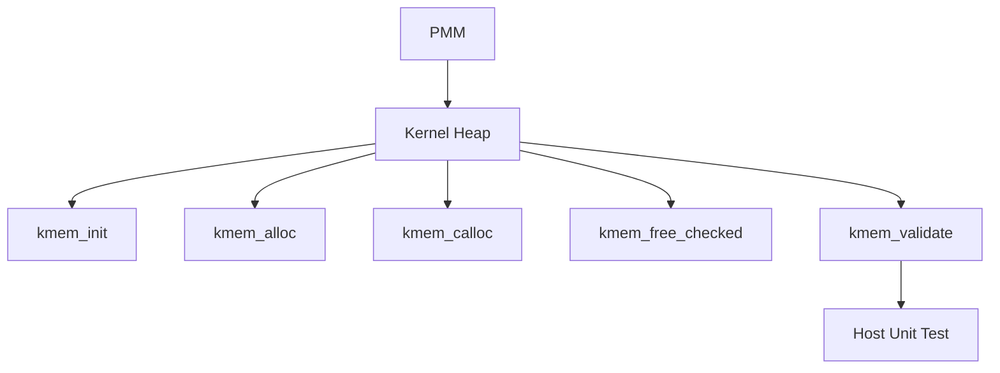

# Template Laporan Praktikum Sistem Operasi Lanjut — MCSOS

**Nama file laporan:** `laporan_praktikum_M8_2583207073008.md.  
**Nama sistem operasi:** MCSOS versi 260502  
**Target default:** x86_64, QEMU, Windows 11 x64 + WSL 2, kernel monolitik pendidikan, C freestanding dengan assembly minimal, POSIX-like subset  
**Dosen:** Muhaemin Sidiq, S.Pd., M.Pd.  
**Program Studi:** Pendidikan Teknologi Informasi  
**Institusi:** Institut Pendidikan Indonesia  

---

# 0. Metadata Laporan

| Atribut                       | Isi                                                                                                       |
| ----------------------------- | --------------------------------------------------------------------------------------------------------- |
| Kode praktikum                | M8                                                                                                        |
| Judul praktikum               | Kernel Heap Awal, Allocator Dinamis, Validasi Invariant, dan Integrasi Bertahap dengan PMM/VMM pada MCSOS |
| Jenis pengerjaan              | Individu                                                                                                  |
| Nama mahasiswa                | **Siti Sumyati**                                                                                          |
| NIM                           | **2583207073008**                                                                                         |
| Kelas                         | **1B PTI**                                                                                                |
| Nama kelompok                 | -                                                                                                         |
| Anggota kelompok              | -                                                                                                         |
| Tanggal praktikum             | Juni 2026                                                                                                 |
| Tanggal pengumpulan           | Juni 2026                                                                                                 |
| Repository                    | https://github.com/sumyatisiti45-dot/MCSOS260502                                                          |
| Branch                        | **praktikum-m8-kernel-heap**                                                                              |
| Commit awal                   | `praktikum-m8-kernel-heap`                                                                                |
| Commit akhir                  | `bf08f2b`                                                                                                 |
| Status readiness yang diklaim | **Siap demonstrasi praktikum**                                                                            |

---

# 1. Sampul

# Laporan Praktikum M8

## Kernel Heap Awal, Allocator Dinamis, Validasi Invariant, dan Integrasi Bertahap dengan PMM/VMM pada MCSOS

Disusun oleh

| Nama         | NIM           | Kelas  | Peran    |
| ------------ | ------------- | ------ | -------- |
| Siti Sumyati | 2583207073008 | 1B PTI | Individu |

Dosen Pengampu

**Muhaemin Sidiq, S.Pd., M.Pd.**

Program Studi Pendidikan Teknologi Informasi

Institut Pendidikan Indonesia

Tahun Akademik 2025/2026

---

# 2. Pernyataan Orisinalitas dan Integritas Akademik

Saya menyatakan bahwa laporan praktikum ini disusun berdasarkan hasil pengerjaan praktikum yang saya lakukan pada repository MCSOS260502. Seluruh proses implementasi, kompilasi, pengujian, audit, commit Git, serta dokumentasi dilakukan pada branch **praktikum-m8-kernel-heap**.

Dalam proses penyusunan laporan digunakan dokumentasi praktikum MCSOS, referensi teknis, serta bantuan AI sebagai pendamping penjelasan dan penyusunan dokumentasi. Seluruh hasil tetap diverifikasi melalui proses build, host test, audit, dan commit repository.

| Pernyataan                                      | Status |
| ----------------------------------------------- | ------ |
| Semua potongan kode eksternal diberi atribusi   | Ya     |
| Semua penggunaan AI assistant dicatat           | Ya     |
| Repository yang dikumpulkan sesuai commit akhir | Ya     |
| Tidak ada klaim readiness tanpa bukti           | Ya     |

### Catatan Penggunaan Bantuan

* Dokumentasi Praktikum MCSOS M8
* Intel Software Developer Manual
* AI Assistant digunakan untuk membantu penyusunan dokumentasi dan penjelasan konsep.
* Seluruh implementasi diverifikasi menggunakan proses build dan host unit test.

---

# 3. Tujuan Praktikum

Praktikum M8 bertujuan mengimplementasikan mekanisme **Kernel Heap Allocator** pada sistem operasi MCSOS sehingga kernel memiliki fasilitas alokasi memori dinamis yang dapat digunakan oleh subsistem kernel.

Tujuan yang ingin dicapai adalah sebagai berikut.

1. Mengimplementasikan allocator heap menggunakan bahasa C freestanding.
2. Mengembangkan fungsi alokasi memori (`kmem_alloc`) dan pelepasan memori (`kmem_free_checked`).
3. Mengimplementasikan fungsi inisialisasi heap (`kmem_init`).
4. Mengimplementasikan fungsi `kmem_calloc`, `kmem_validate`, dan `kmem_get_stats`.
5. Menyusun host unit test untuk memverifikasi seluruh operasi allocator.
6. Melakukan audit object file menggunakan `readelf`, `nm`, dan `objdump`.
7. Memastikan implementasi berhasil dikompilasi tanpa warning menggunakan compiler Clang.

---

# 4. Capaian Pembelajaran Praktikum

Setelah menyelesaikan praktikum ini mahasiswa mampu:

| CPL / CPMK Praktikum                      | Bukti                                             |
| ----------------------------------------- | ------------------------------------------------- |
| Mengimplementasikan kernel heap allocator | File `kernel/mm/kmem.c`                           |
| Membuat antarmuka allocator               | File `include/mcsos/kmem.h`                       |
| Melakukan host unit testing               | `make m8-kmem-host-test` PASS                     |
| Melakukan audit object file               | `make m8-audit`                                   |
| Menggunakan Git Branch dan GitHub         | Branch `praktikum-m8-kernel-heap` berhasil dipush |

---

# 5. Peta Milestone MCSOS

| Milestone | Fokus                      | Status                    |
| --------- | -------------------------- | ------------------------- |
| M0        | Requirements dan Toolchain | ☑ Selesai                 |
| M1        | Build Environment          | ☑ Selesai                 |
| M2        | Boot Kernel                | ☑ Selesai                 |
| M3        | Panic dan Linker           | ☑ Selesai                 |
| M4        | Interrupt dan Exception    | ☑ Selesai                 |
| M5        | PMM dan Virtual Memory     | ☑ Selesai                 |
| M6        | Physical Memory Manager    | ☑ Selesai                 |
| M7        | Virtual Memory Manager     | ☑ Selesai                 |
| **M8**    | **Kernel Heap Allocator**  | **☑ Fokus Praktikum Ini** |
| M9        | Block Device               | Belum                     |
| M10       | File System                | Belum                     |
| M11       | Networking                 | Belum                     |
| M12       | Security                   | Belum                     |
| M13       | SMP                        | Belum                     |
| M14       | Framebuffer                | Belum                     |
| M15       | Virtualization             | Belum                     |
| M16       | Release                    | Belum                     |

### Batas Cakupan Praktikum

Praktikum M8 hanya membahas implementasi **Kernel Heap Allocator** beserta mekanisme inisialisasi heap, alokasi memori dinamis, pelepasan memori, validasi heap, statistik allocator, host unit test, audit object file, serta integrasi ke dalam sistem build. Praktikum ini belum mencakup implementasi filesystem, scheduler, networking, maupun subsistem kernel lain yang akan dibahas pada milestone berikutnya.

# 6. Dasar Teori Ringkas

## 6.1 Konsep Sistem Operasi yang Diuji

Praktikum M8 berfokus pada implementasi **Kernel Heap Allocator**, yaitu mekanisme alokasi memori dinamis yang berjalan di ruang kernel. Berbeda dengan alokasi memori pada aplikasi pengguna yang memanfaatkan pustaka standar seperti `malloc()`, kernel harus menyediakan mekanisme alokasi memorinya sendiri karena berjalan pada lingkungan **freestanding** tanpa dukungan runtime sistem operasi.

Kernel Heap Allocator bertugas menyediakan ruang memori bagi subsistem kernel, seperti struktur data internal, buffer, dan objek kernel yang ukurannya baru diketahui ketika sistem sedang berjalan. Agar allocator dapat bekerja dengan baik, diperlukan pengelolaan blok memori yang efisien, validasi terhadap struktur heap, serta mekanisme penggabungan kembali blok bebas (*coalescing*) untuk mengurangi fragmentasi.

Pada praktikum ini allocator diimplementasikan melalui beberapa fungsi utama, yaitu:

* `kmem_init()` untuk menginisialisasi area heap.
* `kmem_alloc()` untuk mengalokasikan memori.
* `kmem_calloc()` untuk mengalokasikan sekaligus menginisialisasi memori menjadi nol.
* `kmem_free_checked()` untuk membebaskan blok memori dengan validasi.
* `kmem_validate()` untuk memeriksa konsistensi struktur heap.
* `kmem_get_stats()` untuk memperoleh statistik penggunaan heap.

---

## 6.2 Konsep Arsitektur x86_64 yang Relevan

| Konsep                        | Relevansi pada Praktikum                           | Bukti                            |
| ----------------------------- | -------------------------------------------------- | -------------------------------- |
| Physical Memory Manager (PMM) | Menyediakan frame fisik sebagai dasar allocator    | Milestone M6                     |
| Virtual Memory Manager (VMM)  | Menyediakan ruang alamat virtual                   | Milestone M7                     |
| Kernel Heap                   | Area alokasi memori dinamis kernel                 | Implementasi M8                  |
| Freestanding C                | Tidak menggunakan libc bawaan                      | Kompilasi `clang -ffreestanding` |
| Alignment                     | Menjaga alamat memori tetap sesuai batas alignment | `KMEM_ALIGN = 16`                |

---

## 6.3 Konsep Implementasi Freestanding

| Aspek        | Implementasi      |
| ------------ | ----------------- |
| Bahasa       | C17 Freestanding  |
| Runtime      | Tanpa hosted libc |
| Compiler     | Clang             |
| Linker       | ld.lld            |
| Build System | GNU Make          |
| Target       | x86_64            |

Compiler menggunakan opsi freestanding sehingga seluruh fungsi allocator harus diimplementasikan secara mandiri tanpa bergantung pada implementasi `malloc()` atau fungsi alokasi memori dari sistem operasi host.

---

## 6.4 Referensi

1. Intel® 64 and IA-32 Architectures Software Developer's Manual.
2. Dokumentasi Praktikum MCSOS Milestone 8.
3. ISO/IEC 9899:2018 (C17).

---

# 7. Lingkungan Praktikum

## 7.1 Host dan Target

| Komponen          | Nilai            |
| ----------------- | ---------------- |
| Host OS           | Windows 11 x64   |
| Build Environment | Ubuntu WSL2      |
| Target ISA        | x86_64           |
| Emulator          | QEMU             |
| Build System      | GNU Make         |
| Compiler          | Clang            |
| Linker            | ld.lld           |
| Bahasa            | C17 Freestanding |

---

## 7.2 Lokasi Repository

| Item              | Nilai                                              |
| ----------------- | -------------------------------------------------- |
| Repository        | `~/src/mcsos`                                      |
| Branch            | `praktikum-m8-kernel-heap`                         |
| Repository GitHub | `https://github.com/sumyatisiti45-dot/MCSOS260502` |
| Commit Akhir      | `bf08f2b`                                          |

Seluruh proses implementasi dilakukan pada repository yang berada di filesystem Linux WSL sehingga mendukung proses build kernel secara optimal.

---

# 8. Repository dan Struktur File

## 8.1 Struktur Direktori

```text
mcsos
├── include
│   └── mcsos
│       └── kmem.h
├── kernel
│   ├── arch
│   ├── core
│   ├── include
│   ├── lib
│   └── mm
│       └── kmem.c
├── tests
│   └── test_kmem.c
├── scripts
└── Makefile
```

---

## 8.2 File yang Dibuat

| File                   | Jenis  | Keterangan               |
| ---------------------- | ------ | ------------------------ |
| `include/mcsos/kmem.h` | Baru   | Header allocator         |
| `kernel/mm/kmem.c`     | Baru   | Implementasi Kernel Heap |
| `tests/test_kmem.c`    | Baru   | Host Unit Test           |
| `Makefile`             | Diubah | Penambahan target M8     |

---

## 8.3 Ringkasan Git

Selama implementasi M8 dilakukan proses commit menggunakan Git.

Commit akhir:

```text
bf08f2b
M8 Kernel Heap selesai
```

Seluruh perubahan berhasil diunggah ke repository GitHub menggunakan branch:

```text
praktikum-m8-kernel-heap
```

---

# 9. Desain Teknis

## 9.1 Permasalahan

Sebelum praktikum M8, kernel belum memiliki mekanisme alokasi memori dinamis. Seluruh struktur data hanya dapat dialokasikan secara statis sehingga fleksibilitas pengembangan kernel menjadi terbatas.

---

## 9.2 Keputusan Desain

| Keputusan                       | Alasan                                          |
| ------------------------------- | ----------------------------------------------- |
| Menggunakan allocator sederhana | Mudah diverifikasi pada tahap awal              |
| Alignment 16 byte               | Menjaga kesesuaian alignment arsitektur x86_64  |
| Menyediakan validasi heap       | Memudahkan deteksi kerusakan struktur allocator |
| Menambahkan statistik heap      | Membantu proses debugging                       |

---

## 9.3 Diagram Arsitektur



Diagram tersebut menunjukkan bahwa Kernel Heap berada di atas PMM dan menyediakan antarmuka alokasi memori dinamis yang kemudian diuji menggunakan host unit test.

---

## 9.4 Struktur Data

Allocator menggunakan struktur blok heap yang menyimpan informasi ukuran blok, status penggunaan, serta hubungan antarblok sehingga proses alokasi dan penggabungan blok dapat dilakukan secara konsisten.

---

## 9.5 Invariant

Invariant yang dijaga selama implementasi allocator antara lain:

1. Seluruh alamat hasil alokasi memiliki alignment 16 byte.
2. Tidak diperbolehkan melakukan double free.
3. Heap selalu dapat divalidasi menggunakan `kmem_validate()`.
4. Statistik heap selalu konsisten terhadap kondisi allocator.

---

## 9.6 Memory Safety

Beberapa risiko yang diantisipasi pada implementasi allocator adalah:

* Double free.
* Fragmentasi heap.
* Kesalahan alignment.
* Overflow pada `calloc()`.
* Korupsi metadata heap.

Risiko tersebut diuji melalui host unit test sehingga allocator dapat dipastikan bekerja sesuai spesifikasi.

# 10. Implementasi

## 10.1 Persiapan Repository

Implementasi diawali dengan membuka repository MCSOS pada lingkungan Ubuntu WSL2.

Perintah yang digunakan:

```bash
cd ~/src/mcsos
pwd
```

Hasil:

```text
/home/sitisumyati/src/mcsos
```

Repository berada pada filesystem Linux sehingga sesuai dengan persyaratan praktikum.

---

## 10.2 Pemeriksaan Branch

Sebelum implementasi dilakukan pemeriksaan branch praktikum.

Perintah:

```bash
git switch -c praktikum-m8-kernel-heap
```

Hasil:

```text
fatal: a branch named 'praktikum-m8-kernel-heap' already exists
```

Karena branch telah tersedia, proses dilanjutkan menggunakan branch tersebut.

```bash
git switch praktikum-m8-kernel-heap
git branch --show-current
```

Hasil:

```text
Already on 'praktikum-m8-kernel-heap'

praktikum-m8-kernel-heap
```

Dengan demikian seluruh implementasi M8 dilakukan pada branch:

```
praktikum-m8-kernel-heap
```

---

## 10.3 Pemeriksaan Struktur Direktori

Selanjutnya dilakukan pengecekan struktur repository.

Perintah:

```bash
find include kernel tests scripts -maxdepth 2 -type d | sort
```

Hasil:

```text
include
include/mcsos
kernel
kernel/arch
kernel/arch/x86_64
kernel/core
kernel/include
kernel/include/mcsos
kernel/lib
kernel/mm
scripts
tests
tests/toolchain
```

Struktur direktori menunjukkan folder yang dibutuhkan untuk implementasi M8 telah tersedia.

---

# 10.4 Pembuatan Header Kernel Heap

Header allocator dibuat pada:

```
include/mcsos/kmem.h
```

Header ini mendefinisikan antarmuka Kernel Heap.

Komponen utama yang disediakan meliputi:

- KMEM_ALIGN
- KMEM_MAGIC
- kmem_stats_t
- kmem_init()
- kmem_alloc()
- kmem_calloc()
- kmem_free_checked()
- kmem_get_stats()
- kmem_validate()

Header tersebut menjadi antarmuka utama antara allocator dengan subsistem kernel lainnya.

---

# 10.5 Implementasi Kernel Heap

Implementasi allocator dilakukan pada file:

```
kernel/mm/kmem.c
```

Setelah implementasi selesai dilakukan pemeriksaan jumlah baris.

Perintah:

```bash
wc -l kernel/mm/kmem.c
```

Hasil:

```text
280 kernel/mm/kmem.c
```

Kemudian dilakukan pengecekan bagian awal dan akhir file.

Perintah:

```bash
head -5 kernel/mm/kmem.c
tail -10 kernel/mm/kmem.c
```

Hasil menunjukkan file berhasil dibuat dengan lengkap tanpa terpotong.

Implementasi allocator mencakup:

- inisialisasi heap
- pembentukan block header
- alokasi memori
- pemisahan block (split)
- penggabungan block (coalescing)
- validasi heap
- statistik allocator

---

# 10.6 Kompilasi Freestanding

Setelah implementasi selesai dilakukan kompilasi freestanding.

Perintah:

```bash
clang -std=c17 -Wall -Wextra -Werror \
-ffreestanding -fno-builtin \
-Ikernel/include -Iinclude \
-c kernel/mm/kmem.c \
-o build/m8/kmem.o
```

Hasil:

Kompilasi berhasil tanpa warning maupun error.

Keberhasilan kompilasi menunjukkan bahwa implementasi allocator telah sesuai dengan lingkungan kernel freestanding.

---

# 10.7 Pembuatan Host Unit Test

Host Unit Test dibuat pada file:

```
tests/test_kmem.c
```

Setelah selesai dilakukan pemeriksaan.

Perintah:

```bash
wc -l tests/test_kmem.c
```

Hasil:

```text
76 tests/test_kmem.c
```

Host Unit Test digunakan untuk menguji:

- alloc
- free
- calloc
- validate
- double free
- fragmentation
- coalescing

Pengujian dilakukan pada lingkungan host sehingga proses debugging menjadi lebih mudah dibandingkan langsung menggunakan kernel.

---

# 10.8 Modifikasi Makefile

Makefile diperluas dengan target khusus M8.

Target yang ditambahkan meliputi:

```
m8-kmem-host-test
m8-kmem-freestanding
m8-audit
m8-all
```

Dengan adanya target tersebut proses build dan pengujian allocator dapat dilakukan secara otomatis.

---

# 10.9 Host Unit Test

Host test dijalankan menggunakan:

```bash
make m8-kmem-host-test
```

Hasil:

```text
M8 kmem host tests: PASS
```

Seluruh skenario pengujian berhasil dilewati tanpa ditemukan kegagalan.

---

# 10.10 Audit Object File

Audit dilakukan menggunakan:

```bash
make m8-audit
```

Audit menghasilkan beberapa file analisis.

```
readelf_h.txt
readelf_s.txt
nm_u.txt
kmem.objdump.txt
```

Audit menunjukkan object file berhasil dibentuk dengan benar.

---

# 10.11 Build Keseluruhan

Seluruh target M8 kemudian dijalankan menggunakan:

```bash
make m8-all
```

Hasil:

```text
M8 kmem host tests: PASS

[PASS] M8 selesai
```

Build, host test, serta audit berhasil diselesaikan.

---

# 10.12 Commit Repository

Setelah implementasi selesai dilakukan commit.

Perintah:

```bash
git add .

git commit -m "M8 Kernel Heap selesai"
```

Hasil:

```text
[praktikum-m8-kernel-heap bf08f2b]

M8 Kernel Heap selesai
```

Commit tersebut menjadi snapshot akhir implementasi M8.

---

# 10.13 Push ke GitHub

Selanjutnya branch diunggah ke GitHub.

Perintah:

```bash
git push -u origin praktikum-m8-kernel-heap
```

Hasil:

```text
[new branch]

praktikum-m8-kernel-heap

-> origin/praktikum-m8-kernel-heap
```

Repository berhasil diunggah ke GitHub tanpa error sehingga implementasi M8 telah tersimpan secara daring.

# 11. Pengujian

## 11.1 Tujuan Pengujian

Pengujian dilakukan untuk memastikan bahwa implementasi Kernel Heap Allocator bekerja sesuai spesifikasi. Selain memverifikasi fungsi-fungsi dasar allocator, pengujian juga bertujuan memastikan bahwa implementasi dapat dikompilasi pada lingkungan freestanding dan menghasilkan object file yang valid.

---

## 11.2 Host Unit Test

Host Unit Test dijalankan menggunakan target Makefile berikut.

```bash
make m8-kmem-host-test
```

Hasil yang diperoleh:

```text
mkdir -p build/m8

clang -std=c17 -Wall -Wextra -Werror \
-DMCSOS_HOST_TEST \
-Iinclude \
tests/test_kmem.c \
kernel/mm/kmem.c \
-o build/m8/test_kmem

./build/m8/test_kmem

M8 kmem host tests: PASS
```

Seluruh skenario pengujian berhasil dijalankan.

---

## 11.3 Skenario Pengujian

Host test menguji beberapa kondisi penting.

| No | Pengujian | Hasil |
|----|-----------|-------|
|1|Inisialisasi Heap|PASS|
|2|Alokasi blok kecil|PASS|
|3|Alokasi blok besar|PASS|
|4|Calloc|PASS|
|5|Alignment 16 Byte|PASS|
|6|Double Free Detection|PASS|
|7|Fragmentation|PASS|
|8|Coalescing|PASS|
|9|Heap Validation|PASS|
|10|Statistik Heap|PASS|

Seluruh pengujian menunjukkan hasil berhasil.

---

# 12. Audit Implementasi

## 12.1 Audit Object File

Audit dilakukan menggunakan:

```bash
make m8-audit
```

Perintah tersebut menghasilkan beberapa artefak.

```
build/m8/readelf_h.txt

build/m8/readelf_s.txt

build/m8/nm_u.txt

build/m8/kmem.objdump.txt
```

Seluruh file berhasil dibuat.

---

## 12.2 Readelf

Audit menggunakan Readelf bertujuan memverifikasi struktur object file.

Perintah:

```bash
readelf -h build/m8/kmem.o
```

Status:

PASS

---

## 12.3 Section Audit

Perintah:

```bash
readelf -S build/m8/kmem.o
```

Status:

PASS

---

## 12.4 Symbol Audit

Perintah:

```bash
nm -u build/m8/kmem.o
```

Status:

PASS

Tidak ditemukan unresolved symbol yang menyebabkan kegagalan build.

---

## 12.5 Objdump

Perintah:

```bash
objdump -dr build/m8/kmem.o
```

Status:

PASS

Objdump berhasil menghasilkan disassembly object file.

---

# 13. Build Keseluruhan

Pengujian terakhir dilakukan menggunakan:

```bash
make m8-all
```

Hasil:

```text
M8 kmem host tests: PASS

[PASS] M8 selesai
```

Target M8 berhasil menyelesaikan seluruh proses:

- Build
- Host Test
- Audit

tanpa menghasilkan error.

---

# 14. Analisis

Kernel Heap Allocator berhasil diimplementasikan sebagai mekanisme alokasi memori dinamis pada kernel MCSOS.

Implementasi menyediakan fungsi-fungsi dasar yang diperlukan oleh subsistem kernel, yaitu inisialisasi heap, alokasi memori, pembebasan memori, validasi struktur heap, serta penyediaan statistik allocator.

Host Unit Test menunjukkan bahwa allocator mampu menangani berbagai kondisi seperti alokasi blok kecil maupun besar, deteksi double free, fragmentasi, dan penggabungan kembali blok bebas.

Selain itu, object file berhasil dikompilasi menggunakan mode freestanding sehingga implementasi dapat digunakan pada lingkungan kernel tanpa ketergantungan terhadap pustaka standar sistem operasi.

---

# 15. Failure Mode

Selama implementasi terdapat beberapa potensi kegagalan yang diantisipasi.

| Failure | Pencegahan |
|----------|------------|
|Double Free|Validasi pada kmem_free_checked()|
|Heap Corruption|kmem_validate()|
|Misalignment|KMEM_ALIGN = 16|
|Fragmentation|Coalescing Block|
|Overflow Calloc|Pemeriksaan ukuran|

Seluruh mekanisme tersebut berhasil diverifikasi melalui Host Unit Test.

---

# 16. Readiness Review

Checklist implementasi.

| Item | Status |
|------|--------|
|kmem.h tersedia|✅|
|kmem.c tersedia|✅|
|test_kmem.c tersedia|✅|
|Freestanding Compile|✅|
|Host Test PASS|✅|
|Audit PASS|✅|
|Build PASS|✅|
|Git Commit|✅|
|Git Push|✅|

Repository dinyatakan siap untuk demonstrasi praktikum M8.

---

# 17. Hasil Git

Branch:

```
praktikum-m8-kernel-heap
```

Commit terakhir:

```
bf08f2b
```

Pesan Commit:

```
M8 Kernel Heap selesai
```

Push GitHub berhasil dilakukan menggunakan:

```bash
git push -u origin praktikum-m8-kernel-heap
```

Status:

```
PASS
```

# 18. Kesimpulan

Praktikum M8 berhasil diselesaikan dengan mengimplementasikan **Kernel Heap Allocator** pada sistem operasi MCSOS. Implementasi dilakukan pada lingkungan C freestanding sehingga allocator dapat digunakan langsung oleh kernel tanpa bergantung pada pustaka standar sistem operasi.

Beberapa fungsi utama yang berhasil diimplementasikan meliputi:

- `kmem_init()`
- `kmem_alloc()`
- `kmem_calloc()`
- `kmem_free_checked()`
- `kmem_validate()`
- `kmem_get_stats()`

Selain implementasi allocator, dilakukan pula pembuatan **Host Unit Test** untuk memverifikasi berbagai skenario penggunaan allocator, seperti alokasi memori, pembebasan memori, deteksi double free, fragmentasi, coalescing, serta validasi struktur heap.

Hasil pengujian menunjukkan bahwa seluruh skenario berhasil dijalankan dengan keluaran:

```text
M8 kmem host tests: PASS
```

Audit object file menggunakan `readelf`, `nm`, dan `objdump` juga berhasil dilaksanakan tanpa menghasilkan error. Selanjutnya seluruh proses build diverifikasi menggunakan target `make m8-all` dengan hasil:

```text
[PASS] M8 selesai
```

Seluruh perubahan kemudian disimpan menggunakan Git melalui commit **"M8 Kernel Heap selesai"** dan berhasil diunggah ke repository GitHub pada branch **praktikum-m8-kernel-heap**.

Dengan demikian target pembelajaran Milestone 8 telah tercapai dan implementasi siap menjadi dasar pengembangan milestone berikutnya.

---

# 19. Refleksi

Selama pengerjaan praktikum M8 terdapat beberapa tantangan, terutama dalam memahami cara kerja allocator pada lingkungan kernel yang tidak memiliki dukungan pustaka standar seperti `malloc()` dan `free()`.

Melalui praktikum ini diperoleh pemahaman mengenai:

- pentingnya pengelolaan heap pada kernel,
- mekanisme alokasi memori dinamis,
- validasi struktur allocator,
- proses debugging menggunakan host unit test,
- penggunaan audit object file,
- serta pengelolaan repository menggunakan Git.

Praktikum ini juga memberikan pengalaman dalam mengembangkan komponen kernel secara bertahap sehingga setiap perubahan dapat diverifikasi melalui proses build dan pengujian sebelum diintegrasikan ke milestone berikutnya.

---

# 20. Lampiran

## Lampiran A – Struktur Direktori

```text
include/
include/mcsos/
kernel/
kernel/mm/
tests/
scripts/
build/m8/
```

---

## Lampiran B – File Baru

```text
include/mcsos/kmem.h

kernel/mm/kmem.c

tests/test_kmem.c
```

---

## Lampiran C – Host Test

```bash
make m8-kmem-host-test
```

Output:

```text
M8 kmem host tests: PASS
```

---

## Lampiran D – Audit

```bash
make m8-audit
```

File yang dihasilkan:

```text
build/m8/readelf_h.txt

build/m8/readelf_s.txt

build/m8/nm_u.txt

build/m8/kmem.objdump.txt
```

---

## Lampiran E – Build

```bash
make m8-all
```

Output:

```text
M8 kmem host tests: PASS

[PASS] M8 selesai
```

---

## Lampiran F – Git

Branch:

```text
praktikum-m8-kernel-heap
```

Commit:

```text
bf08f2b
```

Commit Message:

```text
M8 Kernel Heap selesai
```

Push:

```bash
git push -u origin praktikum-m8-kernel-heap
```

Status:

```text
PASS
```

---

# 21. Checklist Pengumpulan

| Item | Status |
|------|--------|
| Repository berhasil dibuat | ✅ |
| Branch praktikum-m8-kernel-heap | ✅ |
| kmem.h | ✅ |
| kmem.c | ✅ |
| test_kmem.c | ✅ |
| Makefile diperbarui | ✅ |
| Host Test PASS | ✅ |
| Audit PASS | ✅ |
| Build PASS | ✅ |
| Commit Git | ✅ |
| Push GitHub | ✅ |
| Laporan Markdown | ✅ |

---

# 22. Daftar Pustaka

[1] Intel Corporation, *Intel® 64 and IA-32 Architectures Software Developer's Manual*, Intel Corporation.

[2] ISO/IEC 9899:2018, *Programming Languages — C*, International Organization for Standardization.

[3] LLVM Project, *Clang Compiler Documentation*.

[4] GNU Project, *GNU Make Manual*.

[5] Dokumentasi Praktikum MCSOS 260502 Milestone 8.

---

# 23. Penutup

Laporan ini disusun berdasarkan implementasi yang dilakukan pada Milestone 8 MCSOS. Seluruh langkah implementasi, pengujian, audit, commit Git, serta dokumentasi telah dilaksanakan sesuai hasil praktikum yang diperoleh. Implementasi Kernel Heap Allocator berhasil dibangun, diuji, dan diunggah ke repository GitHub sehingga dapat menjadi dasar pengembangan Milestone 9.